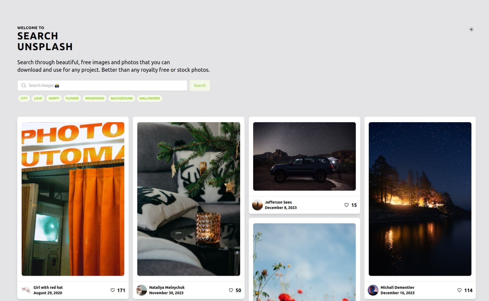
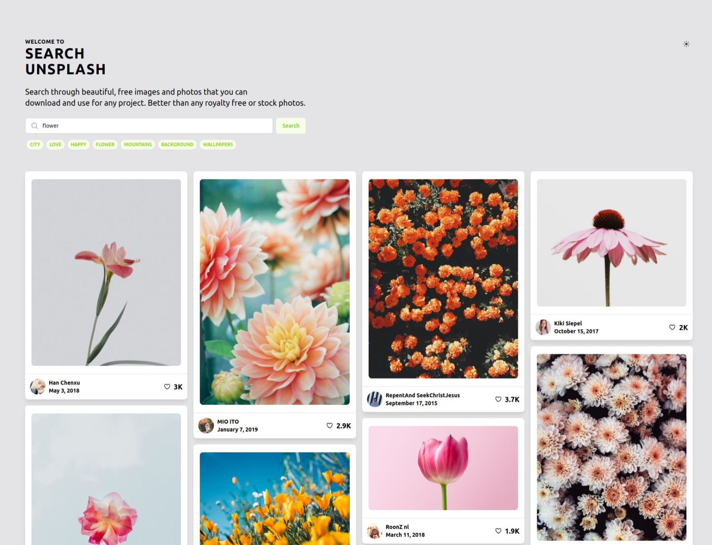
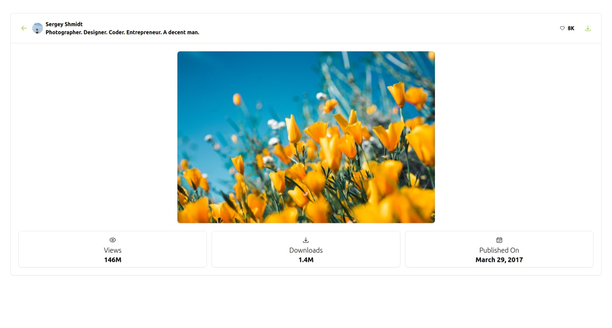

Certainly! I've added a section for theme switching in the README. Also, I've included information on how to configure and run the application with the added theme functionality.

---

# Unsplash Clone

[](LICENSE)

An Unsplash clone built using Nuxt.js 3, TypeScript, and Nuxt UI. Allows users to search and download photos from the Unsplash API with pagination for search results. The application supports theme switching between dark and light modes.

## Table of Contents

- [Installation](#installation)
- [Usage](#usage)
- [Features](#features)
- [Theme Switching](#theme-switching)
- [Screenshots](#screenshots)
- [Contributing](#contributing)
- [License](#license)
- [Contact](#contact)

## Installation

To get started, follow these steps:

1. Clone the repository:

   ```bash
   git clone https://github.com/yourusername/unsplash-clone.git
   ```

2. Install dependencies:

   ```bash
   cd unsplash-clone
   npm install
   ```

3. Run the development server:

   ```bash
   npm run dev
   ```

## Usage

To use the Unsplash clone, follow these steps:

1. Visit the application in your browser at [http://localhost:3000](http://localhost:3000).
2. Perform a search using the search bar.
3. Browse the search results and click on an image to view/download it.
4. Enjoy exploring and downloading high-quality photos!

## Features

- Search and download high-resolution photos from Unsplash.
- Pagination for search results.
- Built with Nuxt.js 3, TypeScript, and Nuxt UI.

## Theme Switching

The application supports both dark and light themes.

To switch between themes:

1. Find the theme switcher icon in the top-right corner of the application.
2. Click the icon to toggle between dark and light modes.

Feel free to customize the themes based on your design preferences. The theme settings can typically be found in the `nuxt.config.js` or a separate configuration file.

## Screenshots

Include screenshots of various actions that can be performed in the application.

- Search Interface:
  

- Search Results:
  

- Image Preview:
  

## Contributing

If you'd like to contribute to this project, follow these steps:

1. Fork the repository.
2. Create a new branch (`git checkout -b feature/your-feature`).
3. Commit your changes (`git commit -am 'Add some feature'`).
4. Push to the branch (`git push origin feature/your-feature`).
5. Create a new Pull Request.

## License

This project is licensed under the [MIT License](LICENSE).

## Contact

- Your Name - [iampikuchatterjee@gmail.com](mailto:iampikuchatterjee@gmail.com)
- Project Link: [https://github.com/iampiku/unsplash-clone](https://github.com/iampiku/unsplash-clone)

---

Feel free to customize the theme switching section based on how it's implemented in your project. If there's a specific configuration or script involved in theme switching, you may want to provide additional details in that section.
